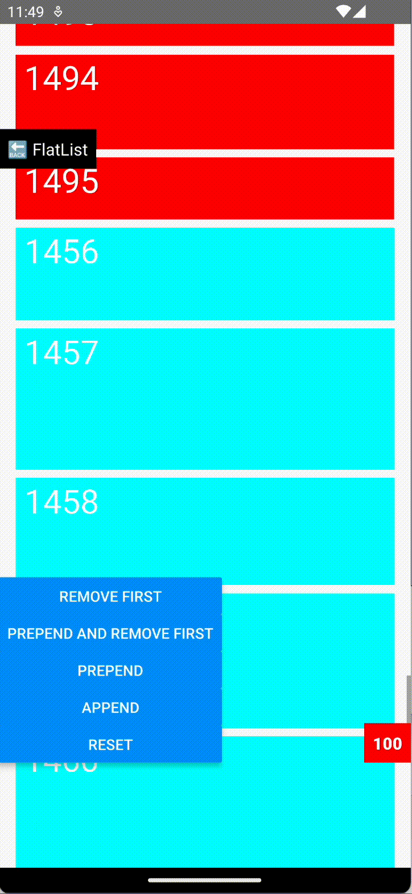
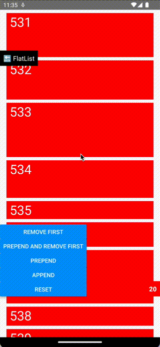

# react-native-bidirectional-flatlist
[](https://www.npmjs.com/package/react-native-bidirectional-flatlist)
[](https://opensource.org/licenses/MIT)

A FlatList replacement which uses the official React Native Implementation of FlatList and adds [Item height calculation](#item-height-calculation) of list items and [correction of the current scroll position](#adjust-the-current-scroll-position) on top of it.
Tested with React Native 0.69 (for RN < 0.68 see [Troubleshooting](#troubleshooting))

## How is it done

### Item height calculation
Whenever a new list item is added to the list, the height of this new item is calculated outside of the viewport and will be used later on in the `getItemLayout` function. You can skip this step by providing your own implementation / function of `getItemLayout`.

### Adjust the current scroll position
When items will be prepended, the heights of the new items will be used to correct the current scroll position of the FlatList. The correction is made in the native part of the ScrollView component.
For iOS, this is not necessary, because the property `maintainVisibleContentPosition` will be used.

## Examples

### Prepend items during scroll


### Remove one item and prepend multiple


## Installation

```sh
npm install react-native-bidirectional-flatlist
```

or

```sh
yarn add react-native-bidirectional-flatlist
```

## Usage

```js
import BidirectionalFlatlist from "react-native-bidirectional-flatlist";

// ...

<BidirectionalFlatlist data={data} renderItem={renderItem} keyExtractor={keyExtractor} />
```

### Properties
| Name          | description                                                                                                                                                                | required | default |
|---------------|----------------------------------------------------------------------------------------------------------------------------------------------------------------------------|--------|---------|
| data          | The data array, see [RN doc](https://reactnative.dev/docs/flatlist#required-data)                                                                                          | ☑️     |         |
| renderItem    | Render function, see [RN doc](https://reactnative.dev/docs/flatlist#required-renderitem). Difference to FlatList: Argument is {item: T; prerendering: boolean}             | ☑️     |         |
| keyExtractor  | Function, which returns the key / id of the item, see [RN doc](https://reactnative.dev/docs/flatlist#keyextractor). Difference to FlatList: The index-Parameter is missing |        | (item) => item.id ?? item.key        |
| getItemLayout | If you know the dimensions of the items you can provide it, otherwise prerendering would be used to determine the height. See [RN doc](https://reactnative.dev/docs/flatlist#getitemlayout)                                             |        |         |
|...||||

Separators are not allowed. For other properties see [RN doc](https://reactnative.dev/docs/flatlist).

## Typescript

Built with Typescript, so works with Typescript out of the box.

## Contributing

See the [contributing guide](CONTRIBUTING.md) to learn how to contribute to the repository and the development workflow.

## Troubleshooting

If you use React Native Version < 0.68.0 the constructor of ReactScrollView is different and therefore you get a crash on Android.
You can change (e.g. with [patch-package](https://github.com/ds300/patch-package)) the constructor like so:
```
import com.facebook.react.bridge.ReactContext;
...

  public ScrollView(ReactContext context) {
    super(context, null);
  }
```

## License

**[MIT](https://github.com/steuerbot/react-native-bidirectional-flatlist/blob/main/LICENSE)**
